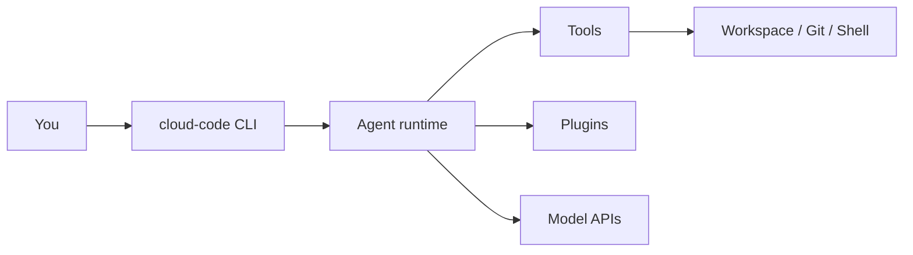

<div align="center">


<br/>


[](https://github.com/riverdoggo/CloudCode)

**A fast terminal coding agent** — read and edit repos, run tools safely, and talk to OpenAI, Anthropic, Ollama, Groq, OpenRouter, and more.

[Install](#install) · [Usage](#usage) · [Configuration](#configuration) · [Docs](#documentation)

</div>

---

<p align="center">
  
</p>

## Why Cloud Code?

| | |
|---|---|
| **Terminal-first** | Stay in your shell — REPL or one-shot prompts |
| **Diff-safe edits** | Changes go through patches, not blind overwrites |
| **Multi-provider** | Swap models without changing your workflow |
| **Local-friendly** | First-class Ollama / local endpoints |
| **Extensible** | Plugins, skills, MCP, and project `CLOUD.md` rules |

## Architecture

<p align="center">
  
</p>



## Install

### Windows (recommended)

```powershell
git clone https://github.com/riverdoggo/CloudCode.git
cd CloudCode
./install-cloud-code.ps1
```

Open a **new** terminal:

```powershell
cloud-code --version
cloud-code
```

### From source (any OS)

```bash
git clone https://github.com/riverdoggo/CloudCode.git
cd CloudCode/rust
cargo install --path crates/claw-cli --force
cloud-code --version
```

## Usage

**Interactive session**

```bash
cloud-code
```

**One-shot task**

```bash
cloud-code prompt "explain the auth flow and suggest tests"
```

**Pick a model**

```bash
cloud-code --model sonnet prompt "fix the failing test in src/auth.rs"
```

**Slash commands** (in the REPL): `/help`, `/init`, `/memory`, `/config`, `/diff`, and more.

## Configuration

| What | Where |
|------|--------|
| API keys & overrides | `.env` (from [`.env.example`](.env.example)) — **never commit** `.env` |
| Project agent rules | [`CLOUD.md`](CLOUD.md) |
| Project settings | `.claw.json` |
| User config | See [`docs/configuration.md`](docs/configuration.md) |

**Quick start for secrets:**

```bash
cp .env.example .env
# Edit .env — add at least ANTHROPIC_API_KEY or OPENAI_API_KEY (etc.)
```

Common variables: `CLOUD_CODE_MODEL`, `CLOUD_CODE_PROVIDER`, `ANTHROPIC_API_KEY`, `OPENAI_API_KEY`, `GROQ_API_KEY`, `OLLAMA_BASE_URL`.

## Development

```bash
cd rust
cargo fmt
cargo clippy --workspace --all-targets -- -D warnings
cargo test -p claw-cli
```

From the repo root: `make dev`, `./scripts/dev.sh`, or `./scripts/dev.ps1`.

## Documentation

- [Architecture](docs/architecture.md)
- [Configuration](docs/configuration.md)
- [Security](docs/security.md)
- [Tool API](docs/tool-api.md)
- [Contributing](docs/contributing.md)

## License

MIT — see [rust/Cargo.toml](rust/Cargo.toml).

---

<div align="center">
  <sub>Built by <a href="https://github.com/riverdoggo">riverdoggo</a> · <a href="https://github.com/riverdoggo/CloudCode">CloudCode on GitHub</a></sub>
</div>
